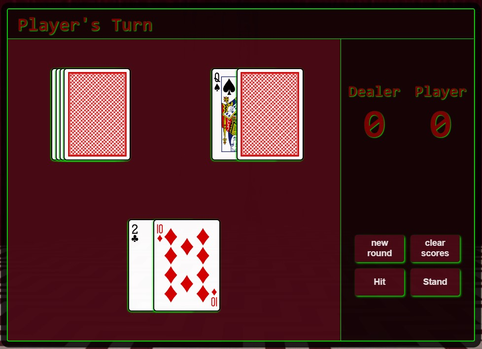

## Twin Peaks BlackJack - [Click to play!](https://juiceteng.github.io/browser-blackjack/)

>"The owls are not what they seem" - The Giant

## Description :owl:
This project is an in browser blackjack game aesthetically themed after the show  
_Twin Peaks_.  

The rules of blackjack are as follows:
* get a hand of 21 or as close as possible without going over
* you may hit to draw cards until you decide to stand
* once you decide to stand, the dealer will draw cards while their hand  
  values less than 17
* after the dealers turn is up the hands are compared to determine a winne

## Screenshots :camera:

## Technologies Used :space_invader:

## Features to Add :mountain_snow:
- [ ] Edit CSS to make to page responsive and accessible on
  different screen sizes
- [ ] Add more advanced features of BlackJack such as  
  split hands and double downs
- [ ] Refactor the JavaScript
- [ ] Tweak the animations and timings to be smoother